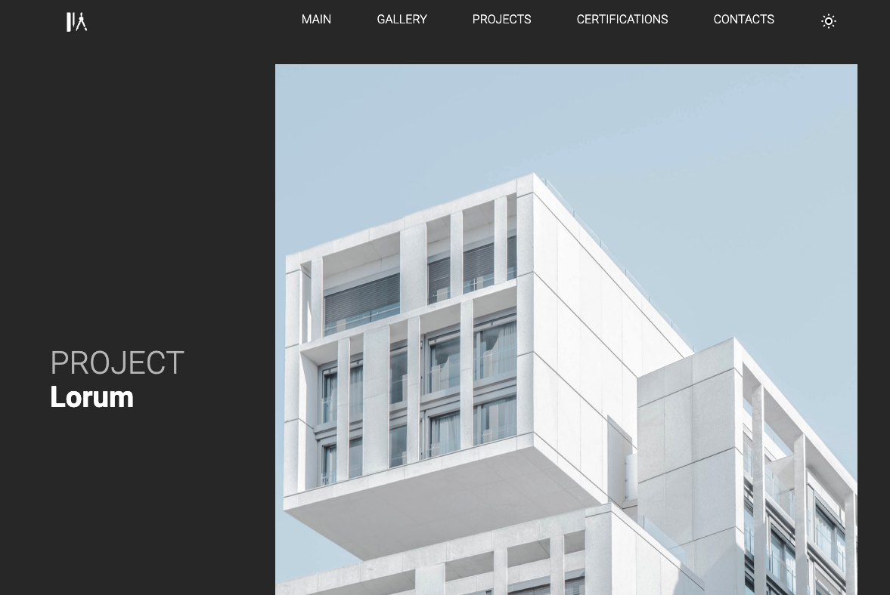
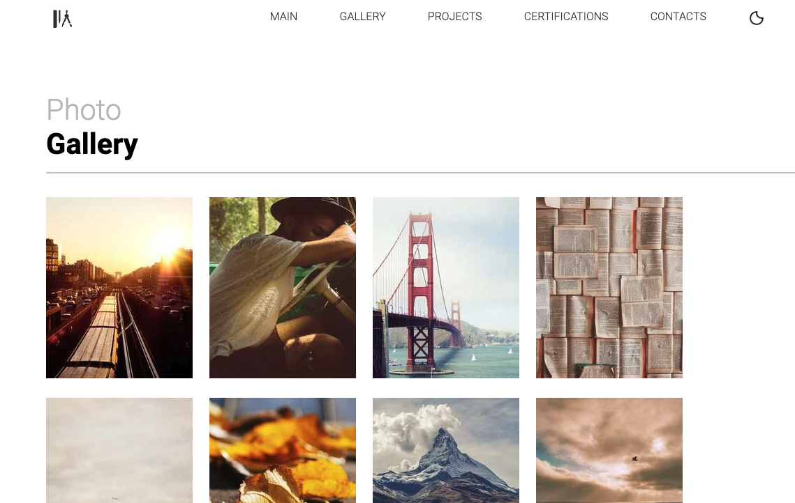

# Project-Architect-Portfolio 🏢

## Overview

Architect Portfolio is a web application built using React, HTML, CSS, React Router DOM for multiple pages, and React Hooks like useState and useContext. The project adheres to a predefined Figma design template.

## Preview




Or check it out on Netlify: [Project Architect Portfolio](https://project-architect-portfolio.netlify.app/)

## Features

- Loading Screen: The application starts with a loading screen.

- Home Page: Users are redirected to the homepage after the loading screen.

- Project Gallery: A dedicated page showcasing various projects.

- Dark/Light Mode: Users can toggle between dark and light mode via a header option, affecting all pages accordingly.

## Technologies Used

- React: For building the user interface.

- HTML: Structure of the web pages.

- CSS: Styling the application.

- React Router DOM: Navigation between multiple pages.

- React Hooks: useState and useContext for state management.

## How to Run the Project

1. Clone the repository:

sh

```
git clone git@github.com:sharonVko/Projekt-Architect-Portfolio.git
```

2. Navigate to the project directory:

```
cd architect-project
```

3. Install dependencies:

```
npm install
```

4. Start the development server:

```
npm start
```

Open your browser to see the application in action.

## Usage

- Loading Screen: Experience the initial loading screen when the application starts.

- Home Page: Navigate to the homepage after the loading screen.

- Project Gallery: Explore various projects showcased in the gallery.

- Dark/Light Mode: Toggle between dark and light mode using the header option.

## Contributing

Feel free to fork this repository, make improvements, and submit a pull request. Contributions are welcome!
